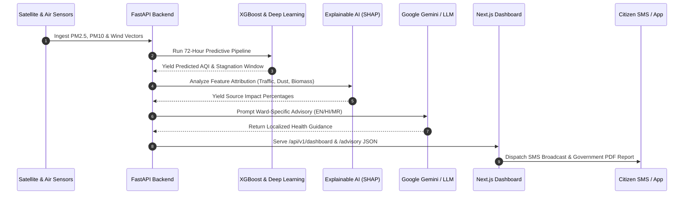

<div align="center">

# 🫁 PranaMap AI
### **AI-Powered Urban Air Quality Intervention Intelligence Platform**

*Proactive Atmospheric Stagnation Forecasting, Multi-Sensor Source Attribution, Explainable Enforcement Planning, and Automated Multilingual Health Advisories for Indian Megacities.*

[](https://nextjs.org/)
[](https://fastapi.tiangolo.com/)
[](https://www.typescriptlang.org/)
[](https://www.python.org/)
[](https://tailwindcss.com/)
[](https://opensource.org/licenses/MIT)

[View Live Dashboard](#-demo) • [System Architecture](#-system-architecture) • [API Documentation](#-key-features) • [Installation Guide](#-installation)

---

</div>

## 📌 Problem Statement

Urban air pollution in megacities like Delhi NCR is an ongoing public health crisis. During winter inversion and stagnation events, AQI levels routinely cross 400+ (Hazardous), leading to severe respiratory illnesses and catastrophic economic disruptions.

### **The Key Decision-Making Challenges:**
1. **Reactive Interventions**: Authorities deploy dust sprinklers and traffic restrictions *after* AQI spikes to hazardous levels, missing the vital pre-stagnation window.
2. **Attribution Ambiguity**: Without real-time chemical mass balance and satellite corroboration, policymakers struggle to isolate the impact of vehicular emissions vs. construction dust vs. agricultural stubble burning.
3. **Actionability Deficit**: Raw AQI sensors provide numbers, but fail to generate prioritized enforcement routes for ground teams or targeted health warnings for vulnerable citizen cohorts.

**PranaMap AI** bridges this gap by transforming raw atmospheric data into proactive, explainable, and multi-agency operational intelligence.

---

##💡 The Solution

PranaMap AI is an end-to-end urban intelligence platform designed for municipal corporations, environmental task forces, and city administration:

- **72-Hour Predictive Stagnation Forecasting**: Deep learning models forecast PM2.5/PM10 spikes before boundary layer collapse occurs.
- **Explainable Source Attribution (XAI)**: SHAP-backed attribution breaks down vehicular, biomass, industrial, and fugitive dust contributions with satellite-corroborated evidence.
- **Enforcement Pipeline Planner**: Priority-ranked mission dispatches with officer assignments, ward coordinates, and projected AQI impact percentages.
- **Automated Multilingual Citizen Advisories**: Generates ward-specific health guidance in **English**, **Hindi (हिंदी)**, and **Marathi (मराठी)** with automated SMS broadcast simulations.

---

## ✨ Key Features

| Feature | Description |
| :--- | :--- |
| 🛡️ **AI Command Center** | Real-time geospatial heatmap of Delhi NCR wards with live status indicators, system health metrics, and hotspot tracking. |
| 📈 **Air Quality Forecasting** | 72-hour predictive trendline with confidence interval bands and peak stagnation alerts. |
| 🔍 **Explainable AI (XAI)** | *"Why did AI make this prediction?"* panel breaking down wind vectors, satellite data, and source impact percentages. |
| 🚨 **Enforcement Planner** | Priority-ranked intervention pipeline (`CRITICAL`, `HIGH`, `MEDIUM`) with direct officer dispatch actions. |
| 📢 **Multilingual Health Advisories** | Instant language switching (`EN`, `HI`, `MR`) across UI labels and AI-generated citizen advisories. |
| 📄 **Government PDF Exporter** | One-click export of official government-formatted health advisory PDF reports (`Advisory_RK_Puram_2026.pdf`). |
| 📱 **Broadcast SMS Demo** | Interactive confirmation modal dialog and simulated SMS dispatch to registered ward citizens. |
| 🌗 **Dark / Light Theme Engine** | Full theme toggle system with `localStorage` persistence and dynamic Recharts chart color adaptation. |
| 🔄 **Demo Mode & Live API Mode** | Seamless toggle between offline deterministic demo data and FastAPI backend service. |
| 📱 **Fully Responsive UI** | Desktop fixed sidebar, tablet collapsible drawer, mobile overlay, and touch-optimized data tables. |

---

## 🏗️ System Architecture

```mermaid
flowchart TD
    subgraph Client ["Frontend Layer (Next.js 14 & TailwindCSS)"]
        UI[Command Center Dashboard]
        i18n[Multilingual i18n Engine]
        Theme[Theme Provider]
        PDF[PDF Export Utility]
    end

    subgraph API ["API Gateway Layer (FastAPI)"]
        Router[/api/v1 Endpoints]
        HealthCheck[Health & Latency Check]
        BroadcastRoute[/advisory/broadcast]
        ActionRoute[/enforcement/action]
    end

    subgraph Intelligence ["AI & Analytics Engine"]
        ForecastEngine[72h Stagnation Forecaster]
        XAIEngine[Explainable AI Attribution]
        AdvisoryGen[LangChain & Gemini Advisory Generator]
    end

    subgraph Data ["Data & Storage Layer"]
        PostGIS[(PostGIS Spatial DB)]
        MockEngine[Offline Demo Engine]
    end

    UI --> Router
    i18n --> UI
    Theme --> UI
    PDF --> UI

    Router --> HealthCheck
    Router --> ForecastEngine
    Router --> XAIEngine
    Router --> AdvisoryGen

    ForecastEngine --> PostGIS
    XAIEngine --> PostGIS
    AdvisoryGen --> PostGIS
    Router -. Fallback .-> MockEngine
```

---

## 🔄 AI Workflow



---

## 🛠️ Tech Stack

| Domain | Technologies |
| :--- | :--- |
| **Frontend Framework** | Next.js 14 (App Router), React 18, TypeScript |
| **Styling & Theme** | Tailwind CSS, Lucide React, CSS Custom Variables |
| **Data Visualization** | Recharts, MapLibre GL, React Map GL |
| **Backend Framework** | FastAPI (Python 3.11), Uvicorn, Pydantic |
| **AI / Agentic Workflow** | LangChain, LangGraph, Google Gemini API |
| **Machine Learning** | XGBoost, LightGBM, SHAP, Scikit-Learn |
| **Spatial Database** | PostgreSQL, PostGIS, GeoPandas |
| **State & Fetching** | Zustand, Axios, React Query |
| **Deployment** | Vercel (Frontend), Render / Docker (Backend) |

---

## 📁 Folder Structure

```
PranaMap-AI/
├── backend/
│   ├── app/
│   │   ├── api/
│   │   │   ├── advisory.py         # Advisory endpoints & SMS broadcast
│   │   │   ├── attribution.py      # Source attribution API
│   │   │   ├── dashboard.py        # Command center telemetry
│   │   │   ├── enforcement.py      # Action dispatch endpoints
│   │   │   ├── forecast.py         # 72-hour forecasting API
│   │   │   └── health.py           # Backend health check
│   │   ├── core/                   # Configuration & CORS settings
│   │   ├── services/               # ML & AI inference services
│   │   └── main.py                 # FastAPI application entry point
│   ├── requirements.txt            # Python dependencies
│   └── Dockerfile
│
├── frontend/
│   ├── src/
│   │   ├── app/
│   │   │   ├── (dashboard)/        # Command Center, Forecast, Advisory, Settings
│   │   │   └── (marketing)/        # Landing page
│   │   ├── components/
│   │   │   ├── Advisory/           # BroadcastModal & advisory cards
│   │   │   ├── Alerts/             # Critical alert banners
│   │   │   ├── Charts/             # AQILineChart, ForecastChart, SourceBarChart
│   │   │   ├── Common/             # AIExplanationPanel, KPICard, Toast
│   │   │   ├── Map/                # BaseMap, AQIMap (MapLibre GL)
│   │   │   ├── Navbar/             # Header & LandingNavbar
│   │   │   └── Sidebar/            # NavigationSidebar drawer
│   │   ├── i18n/                   # Multilingual translations (EN, HI, MR)
│   │   ├── theme/                  # ThemeContext & Light/Dark engine
│   │   ├── store/                  # Zustand state management
│   │   ├── services/               # Axios API client
│   │   └── utils/                  # pdfExport & constants
│   ├── tailwind.config.ts
│   └── package.json
│
├── docs/                           # Architecture & API documentation
├── docker-compose.yml
└── README.md
```

---

## ⚙️ Installation & Setup

### **Prerequisites**
- Node.js `v18.x` or higher
- Python `v3.10` or higher
- Git

### **1. Clone the Repository**
```bash
git clone https://github.com/kamalsolanki143/PranaMap-AI.git
cd PranaMap-AI
```

### **2. Backend Setup (FastAPI)**
```bash
# Navigate to backend directory
cd backend

# Create a virtual environment
python -m venv venv
source venv/bin/activate  # On Windows: venv\Scripts\activate

# Install dependencies
pip install -r requirements.txt

# Start FastAPI development server
uvicorn app.main:app --reload --port 8000
```
*Backend running at:* `http://localhost:8000`  
*Swagger Documentation:* `http://localhost:8000/docs`

### **3. Frontend Setup (Next.js)**
```bash
# Open a new terminal and navigate to frontend directory
cd frontend

# Install dependencies
npm install

# Start Next.js development server
npm run dev
```
*Frontend running at:* `http://localhost:3000`

---

## 🔐 Environment Variables

Create `.env.local` inside `frontend/` directory:

```env
# API Base URL (FastAPI)
NEXT_PUBLIC_API_URL=http://localhost:8000/api/v1

# Enable/Disable Live API mode by default
NEXT_PUBLIC_API_MODE=live
```

Create `.env` inside `backend/` directory:

```env
# Core API Settings
API_V1_STR=/api/v1
PROJECT_NAME=PranaMap AI

# AI Models & Keys
GEMINI_API_KEY=your_gemini_api_key_here
```

---

## 🖼️ Application Screenshots

| Page | Preview |
| :--- | :--- |
| **Landing Page** |  |
| **Command Center** |  |
| **Predictive Forecast** |  |
| **Source Attribution** |  |
| **Enforcement Planner** |  |
| **Citizen Advisories** |  |
| **System Settings** |  |

---

## 🎥 Live Demonstration

[](https://youtube.com/)

---

## 👥 Contributors

- **Kamal Solanki** — Lead Full Stack & Product Engineer ([@kamalsolanki143](https://github.com/kamalsolanki143))

---

## 🚀 Future Scope

- **IoT Sensor Node Integration**: Direct MQTT streaming from low-cost CPCB-calibrated physical sensors.
- **Automated Anti-Smog Gun IoT Triggering**: Direct SCADA integration to automatically activate mist sprayers when ward AQI crosses 350.
- **Hyperlocal Satellite Synthetic Aperture Radar (SAR)**: High-resolution thermal anomaly mapping for stubble fires.

---

## 📜 License

Distributed under the MIT License. See [`LICENSE`](LICENSE) for more information.

---

## 🙏 Acknowledgements

- [Google Gemini API](https://ai.google.dev/) for AI natural language advisory generation.
- [FastAPI](https://fastapi.tiangolo.com/) & [Next.js](https://nextjs.org/) for high-performance full-stack architecture.
- [LangChain](https://www.langchain.com/) & [LangGraph](https://www.langchain.com/langgraph) for multi-agent reasoning.
